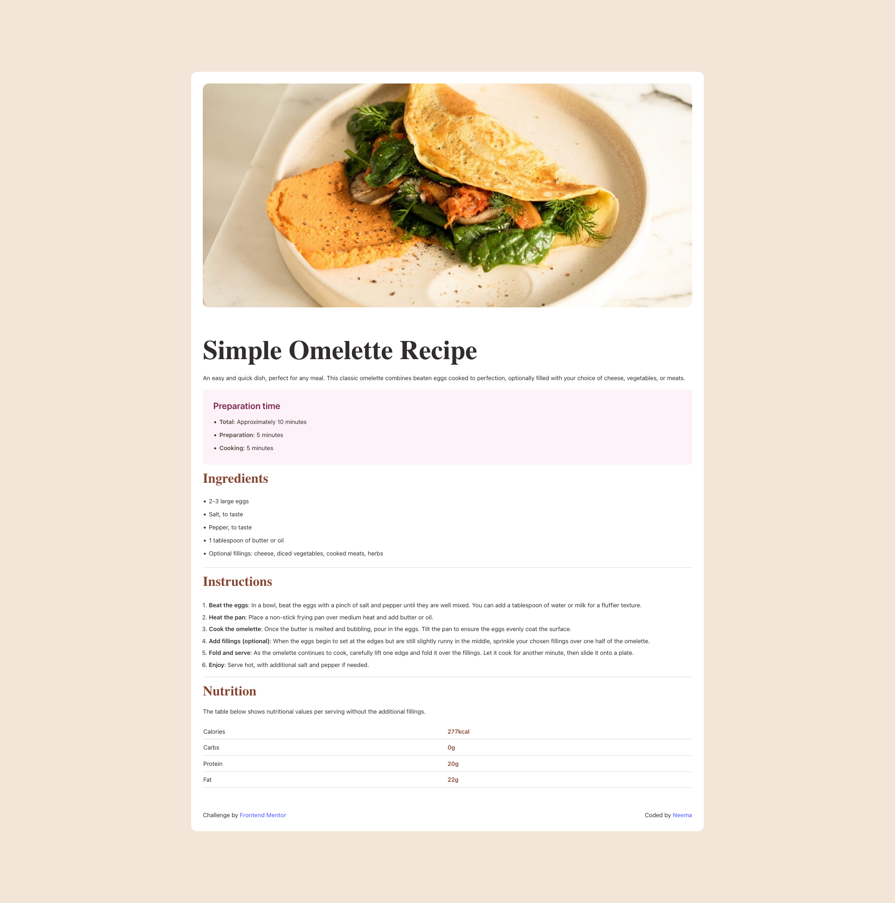

# Frontend Mentor - Recipe page solution

This is a solution to
the [Recipe page challenge on Frontend Mentor](https://www.frontendmentor.io/challenges/recipe-page-KiTsR8QQKm).
Frontend Mentor challenges help you improve your coding skills by building realistic projects.

## Table of contents

- [Overview](#overview)
    - [Screenshot](#screenshot)
    - [Links](#links)
- [My process](#my-process)
    - [Built with](#built-with)
    - [What I learned](#what-i-learned)
    - [Useful resources](#useful-resources)
- [Author](#author)

## Overview

### Screenshot

### Links

- Solution URL: [https://github.com/Annmayn/fem_recipe_page](https://github.com/Annmayn/fem_recipe_page)
- Live Site URL: [Coming Soon]()

## My process

### Built with

- [Typescript](https://www.typescriptlang.org/)
- [React](https://reactjs.org/)
- [Tailwind](https://tailwindcss.com/)

### What I learned

It is wayyyy easier to start mobile first and then handle bigger screens. This is also the first personal project of
mine in react and tailwind, so I learned a lot about the setup and configuration for them.

### Useful resources

- [Tailwind Docs](https://tailwindcss.com/docs/) - My go to for css styling

## Author

- LinkedIn - [Neema Tsering](https://www.linkedin.com/in/neema-tsering/)
- Frontend Mentor - [@yourusername](https://www.frontendmentor.io/profile/Annmayn)
